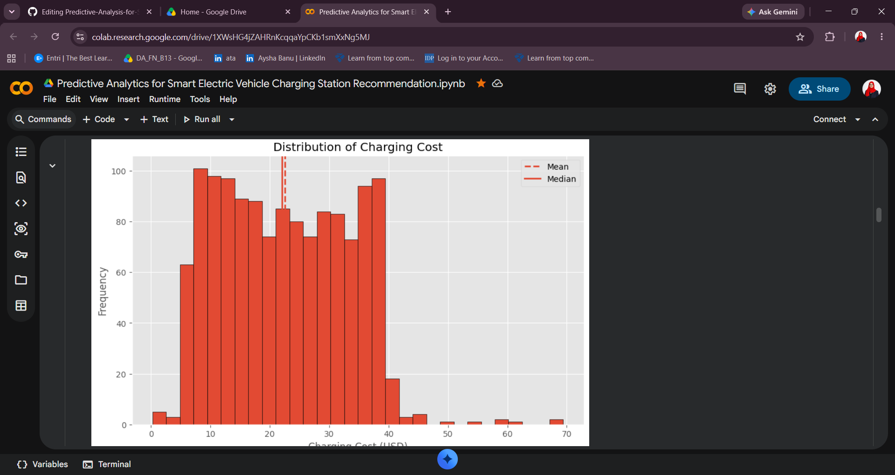

# Predictive Analysis for Smart Electric Vehicle Charging Station Recommendation
Electric Vehicle (EV) charging demand is increasing rapidly, making it important to understand charging behavior and recommend the best charging station for users.

This project analyzes 1,300 EV charging sessions using Python and Machine Learning. It performs Exploratory Data Analysis (EDA), statistical analysis, feature engineering, and predictive modeling to build a Smart EV Charging Advisor that recommends the most suitable charging station based on historical charging patterns.

## 🎯 Objectives

1.	Analyze EV charging patterns using EDA

2.	Study energy consumption and charging performance

3.	Evaluate charging cost and user behavior

4.	Build a Machine Learning prediction model

5.	Recommend the best charging station using

## 📂 Dataset Information

Dataset-EV Charging Patterns

Total Record-1,300

Features-20+ Columns

Missing Values-Handled during preprocessing

Target Variable-Charging Duration (Hours)

## 🛠 Technologies Used

Programming	-Python

Data Analysis-Pandas, NumPy

Visualization-Matplotlib, Seaborn

Machine Learning-Scikit-Learn

Notebook-Google Colab

## 📊 Project Workflow

Dataset

    │
    ▼
    
Data Cleaning

    │
    ▼
    
Feature Engineering

    │
    ▼
    
Exploratory Data Analysis

    │
    ▼
    
Statistical Analysis

    │
    ▼
    
Machine Learning Model

    │
    ▼
    
Smart EV Charging Advisor

## 📈 Exploratory Data Analysis

The project includes:

✅ Data Cleaning

✅ Missing Value Treatment

✅ Feature Engineering

✅ Statistical Analysis
Analysis

✅ Univariate Analysis

✅ Bivariate Analysis

✅ Multivariate Analysis

## 📷 Project Visuals

Statistic Analysis

## 📊 Statistical Summary

Metric	Result

Total Charging Records	1,300

Average Charging Cost	≈ $22

Average Charging Duration	≈ 2.3 Hours

Common Charging Duration	1–4 Hours

Common Charging Cost	$8–$40

Common Energy Consumption	10–80 kWh

### Correlation Heatmap

### Interpretation

Thursday Afternoon records the highest average charging cost at approximately 27usd, followed by Thursday Morning at around $26.

Monday Evening and Wednesday Night also show relatively high average charging costs of approximately $25.

The lowest average charging costs (around $20) occur on Monday Afternoon and Tuesday Afternoon.

Most other day-and-time combinations have average charging costs between  21and 24, indicating that charging costs remain fairly stable throughout the week.

## 🤖 Machine Learning

Model Used

### ✅ Random Forest Regression

Prediction Target

  Charging Duration

Model Features

Battery Capacity
Charging Rate

Energy Consumed

Charger Type

Vehicle Age

Cost per kWh

Time of Day

User Type 

## 💡Smart EV Charging Advisor

The Smart recommendation system suggests:

✅ Best Charging Station

✅ Estimated Charging Time

✅ Estimated Charging Cost

✅ Recommendation Score

This helps EV users choose faster and more cost-effective charging options.

## Prediction Result

## 📌 Conclusion

This project demonstrates how Exploratory Data Analysis, Statistical Analysis, and Machine Learning can be combined to analyze EV charging behavior and develop an intelligent recommendation system. By analyzing 1,300 charging sessions, the project identified key patterns in charging duration, energy consumption, and charging cost, while the Random Forest Regression model enabled accurate charging duration prediction. The Smart EV Charging Advisor supports users in selecting efficient and cost-effective charging stations, contributing to improved EV charging experiences.

